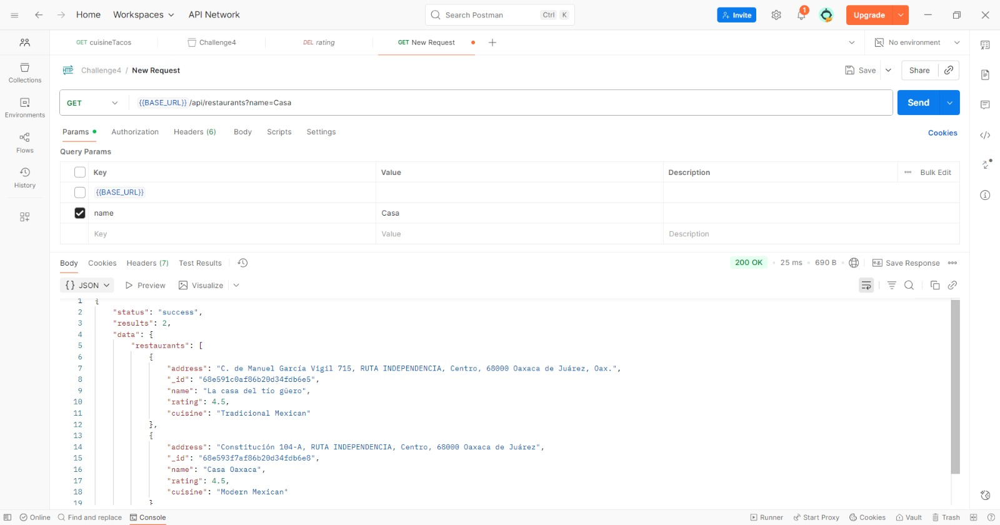

## Menu
- [Sprint 1](#sprint-1)
- [Sprint 2](#sprint-2)
- [Sprint 3](#sprint-3)

## Major Version: 1.1.0
**1. Installation and Usage Prerequisites**

- Node.js (v18.x or later
- npm (Node Package Manager)
- MongoDB (local instance or a cloud service like MongoDB Atlas)
- Git
- Postman or Insomnia for API testing

## Sprint 1

Data base Setup in **Mongo DB Compass**

Collection restaurants.json


Collection  users.json
<br/>

first version of the repository 


**2. Clone the repository in Git:**
````
git clone <git@github.com:SofGuzman-Mx/Non-Relational-Databases-for-Storing-JSON-Data.git>
````
````
cd <Non-Relational-Databases-for-Storing-JSON-Data>
````
## Sprint 2
**Install dependencies**
- moose
- express
- node.js
````
npm install
````


The import scripts require the mongodb and csv-parser packages

**Set up environment variables**
Create a file named `.env` in the root of your project and add your MongoDB connection string.
````
MONGO_URI="mongodb://localhost:27017/tattler_db"
````
Replace the MONGO_URI with your actual connection string from Studio 3T or MongoDB Atlas.

**Running the Application**
To star the server, run the following command:
````
npm start
````
The API will be available at `http://localhost:3000`


JavaScript (JS) code to import users
%20code%20to%20import%20users.png)

Database Setup & Data Import
You can populate the database in two ways:

A) Restoring from Backup:

Use the mongorestore command-line tool to restore the database from the provided backup files located in the db_backup/ directory.
````
mongorestore --uri="mongodb://localhost:27017" --db tattler_db db_backup/tattler_db
````
B) Using the Import Scripts (Recommended for CSV data):

Place your restaurants.csv and users.csv files in the data/ directory. Then, run the import scripts:

Import restaurants
````
node scripts/import-restaurants.js
````

Import users
````
node scripts/import-users.js
````

Import test
````
node scripts/import-test.js
````
These scripts will connect to your MongoDB instance, create the tattler_db database, and populate the restaurants and users collections.

## Sprint 3
**API Endpoints**
The primary endpoint with the new features is:<br/>

`GET /api/products`

**Query Parameters**
### Guide: Testing the API with Postman / Insomnia
This guide will walk you through testing the new search, filter, and sort features of the `/api/products` endpoint.

**Step 1: Add Sample Data**
Before you begin testing, make sure you have some diverse data in your MongoDB `products` collection. Using Studio 3T, add a few documents with different names, categories, and prices.

Example documents:
[
    {

},

]

text search (find items with the word "mexican food" in the name or description):
URL:
Evidence:


**Step 2: Set Up Your Request**
1. Open Postman or Insomnia
2. Create a new GET request
3. Set the request URL to `http://localhost:3000/api/products`

**Step 3: Test the features**
You will test the features by adding parameters to the "Params" or "Query" tab in your API client.

Test 1: Text Search
Test 2: Filtering
Test 3: Sorting
Test 4: Combining All Features

With the new models defined, we can now properly rewrite your controller logic and set up your API routes.

Setting up user registration and login is a crucial step. 


Step 1: Install Required Libraries
- bcryptjs 
- jsonwebtoken<br/>

Open your terminal in the project folder and run:
````
npm install bcryptjs jsonwebtoken
````
result:


Step 2: Create the User Controller:This file will contain the logic for registering a new user and logging in an existing user.<br/>
controllers/userController.js

**Important Security Step: add a `JWT_SECRET` to your `.env` file. This is a secret key used to sign your tokens. Make it long and random.
````
JWT_SECRET="..."
````


Step 3: Create the User Routes
This file will define the API endpoints (`/register, /login`) and connect them to the controller functions you just created.

Create a new file: `routes/userRoutes.js`


Step 4:Update the Main Router
Finally, let's tell your application to use these new user routes.

Update your 
Create a new file: `routes/index.js` file:

We completed our set of endpoints for user authentication! You can use a tool like Postman or Insomnia to test them:

BASE_URL:http://localhost:8888/api/restaurants`
**GET** 


 **POST** request to `BASE_URL`with a JSON body like:

 
 
 **PUT**

 

 
 
 And now the rating is changed
 

**DELET**


## Tests in Postman 
### Search Test (Filtering)
- **Request 1: Search by cuisine type**
````
GET http://localhost:8888/api/restaurants?cuisine=Tacos
````
Expected Result: A list containing only restaurants whose field `cuisine` is "Tacos".


- **Request 2: Search by name**
````
GET http://localhost:8888/api/restaurants?name=casa
````
Expected Result: A list of restaurants that contain the word "house" in their name.


- **Request 3: Sort by rating (highest to lowest)**
````
GET http://localhost:8888/api/restaurants?sort=-rating
````
Expected Result: The full list of restaurants, sorted with highest ratings first.


- **Request 4: Sort by name (alphabetically)**
````
GET http://localhost:8888/api/restaurants?sort=name
````
Expected Result: The complete list of restaurants, sorted alphabetically by name.
